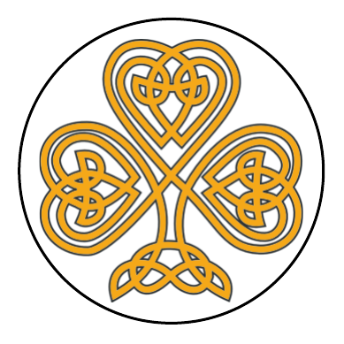

 
<h1 align="left">St. Patrick's the Gathering</h1>
The Magic Shamrocks's submission for Code Institute's March 2021 Hackathon.

## [View the live project here.](https://keisgsmit.github.io/Hackathon/)
---
A pub-quiz/drinking game on cards to play safely from any browser at home! Gather round the screen answer the randomly selected questions, and (optionally) drink every time you're wrong!

This app was built using HTML, CSS, BOOTSTRAP & Javascript and deployed to [github pages](https://keisgsmit.github.io/Hackathon/).

---

## <u>Table of contents</u>

**

 User Experience (UX)
**
  - [Scope](#scope)
  - [Design](#design)
  - [User stories](#user-stories)
  - [Wireframes](#wireframes)

**

 Features
**
  - [Features used](#features-used)
  - [Version and future](#version-and-future)
  - [Status](#status)

**

 Technologies
**
  - [Languages](#languages)
  - [Frameworks, Libraries & Programs](#frameworks-libraries-programs)

**

 Deployment
**
  - [Deploy to Heroku](#deploy-to-heroku)
  - [Accessing code](#accessing-code)

**

 Credits
**
  - [Content](#content)
  - [Media](#media)
  - [Acknowledgements](#acknowledgements)

**

 Contact
**
  - [Contact details](#contact-details) 

### **<u>Wireframes</u>**

As part of the design process, before starting the project we made initial wireframes using Lucidchart. Creating these mock-ups helped me plan the basic structure and arrangement of the features for our site.

The final design has been influenced by the team and mentor feedback so the wireframes map the journey from idea to functioning app.

### **<u>Design</u>**

**Structure**

- A simple clean design with easy to use buttons handles the navigation throughout the app.

**Typography**

- The main font used throughout the site is 'Roboto' which belongs to the sans-serif typeface family. The font is clean and elegant, making it a good choice for web design.

- We have used the 'MedievalSharp' font for titles and headers all over the site.

- Sans Serif is set as the fallback font if for any reason the main fonts aren't being imported into the site correctly.

**Logo Design**

- I created my own logo design with inspiration from old school operating systems. Using the greater than symbol  to create a simple but effective logo.

- Following website conventions, my website logo is a link to the homepage. Over time many people have learned that clicking on a site’s logo leads them back to the homepage so adopting this standard reduces confusion by matching the UI to users’ expectations. The logo is also left-aligned which is the most familiar placement, and is where users look to find it.

### <u>**User stories**</u>

 

## &rarr; **Features**

- **A user-friendly interface with easy navigation throughout the site**
  - Attractive, minimalistic design with visuals and information presented clearly and concisely.

  - Easily readable fonts and simple navigation throughout the site.
    - Fixed navigation bar visible on every page including a menu dropdown and brand logo to link back to the homepage.

  
- **Buttons**
    - Clear interactive buttons used for a effortless user journey.

### **Version and Future**

#### Status

> App Version: <u>0.9/u>

---

## &rarr; **Technologies**

#### Languages Used

-   The app was created using [HTML5](https://en.wikipedia.org/wiki/HTML5) styled with custom [CSS3](https://en.wikipedia.org/wiki/Cascading_Style_Sheets) styles. 
-   The logic scripts were written in [JavaScript](https://developer.mozilla.org/en-US/docs/Web/JavaScript).

#### Frameworks, Libraries & Programs Used

1. [Bootstrap 4.5:](https://getbootstrap.com/)
    * Bootstrap 4.5 css was used to create the selector and game board elements of the app with custom styles applied where necessary.
2. [JQuery 3.5:](https://jquery.com/)
    * JQuery methods variables and selectors are used with the goal of minimizing the length of the code.
3. [Google Fonts:](https://fonts.google.com/)
    * Google fonts were used to import the [Cormorant SC](https://fonts.google.com/specimen/Cormorant+SC) font into the style.css file which is used on all text elements of the app.
4. [Git:](https://git-scm.com/)
    * Git was used for version control by utilizing the Gitpod terminal to commit to Git and Push to GitHub.
5. [GitHub:](https://github.com/)
    * GitHub was used to store the projects code after being pushed from Git.
7. [GitPod:](https://gitpod.io)
    * GitHut very own IDE was used to write all of the code for this app.
6. [Photoshop:](https://www.adobe.com/ie/products/photoshop.html)
    * Photoshop was used to create the app logo and the transparent background images for the faction icons, as well as for minor styling and size changes to them.
7. [Lucidchart:](https://lucid.app/users/login#/login)
    * Lucidchart was used to create both the *wireframes* shown above for the front end design as well as the [flowcharts](https://github.com/NikolasKotsikos/Warhammer40kTicTacToe/assets/diagrams/Flowchart-Logic.png) and [diagrams](https://github.com/NikolasKotsikos/Warhammer40kTicTacToe/assets/diagrams/Diagram-VictoryConditions.png) for the app's logic.

---

## &rarr; **Deployment**

#### GitHub Pages

The project was deployed to GitHub Pages using the following steps...

1. Logged in to GitHub and located the [GitHub Repository](https://github.com/NikolasKotsikos/Warhammer40kTicTacToe)
2. At the top of the Repository, located the "Settings" Button on the menu. 
3. Scrolled down the Settings page until "GitHub Pages" Section was located.
4. Under "Source", clicked the dropdown called "None" and selected "Master Branch".
5. The page automatically refreshed.
6. Scrolled back down through the page to locate the now published site [link](https://github.com/NikolasKotsikos/Warhammer40kTicTacToe/index.html) in the "GitHub Pages" section.

### How to install this project locally

To clone this project from GitHub:

1. Go to the [Project GitHub repository](https://github.com/NikolasKotsikos/Warhammer40kTicTacToe).
2. In the main Repository page, in the **<>Code** tab, click on the green **Code** button and select clone with HTTPS.
3. In the Clone with HTTPs section, copy the clone URL displayed. 
4. Open Git Bash in your local editor.
5. Change the current working directory to the location where you want the cloned directory to be created.
6. Type **git clone**, and then paste the URL you copied in Step 3 and press enter.
7. Your local clone will be created.ious friends and family members. The are taken from [EuroGamer](https://www.organix.com/), [GameSpot](https://www.gamespot.com/) and [Tweakers](https://tweakers.net/). All other reviews have been added from user testing.

#### Media

> **Please note:** The images on this site are only being used for non-profit educational purposes.

#### Acknowledgments

- Our Mentor, Richard for his help and support throughout the project.

- Friends and family members for their feedback and support.

## &rarr; **Contact**

#### Contact us

**The Magic Shamrocks are:**
    - Sandra Atino
    - Kirsty Harper
    - Nikolas Kotsikos
    - Eugenia Musat
    - Keis Smit

 

 